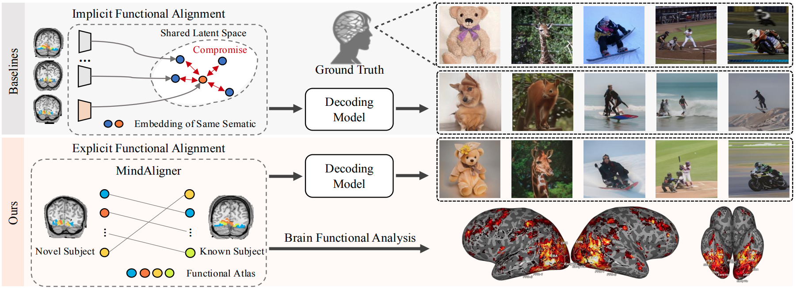
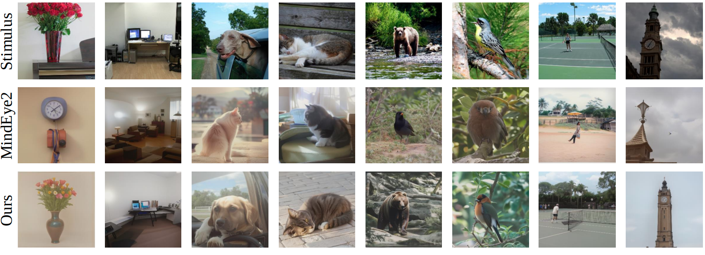

# MindAligner
Code for our [ICML 2025 paper](https://arxiv.org/pdf/2502.05034) : "MindAligner: Explicit Brain Functional Alignment for Cross-Subject Brain Visual Decoding with Limited Data"


✨ Welcome to give a star! ✨

<p float="left">
    
    
</p>


## Environment
Use our setup.sh for environment preparation:

    bash setup.sh


## Data Preparation
In our experiments, we use NSD for both training and evaluation. 

1. Agree to the Natural Scenes Dataset's [Terms and Conditions](https://cvnlab.slite.page/p/IB6BSeW_7o/Terms-and-Conditions) and fill out the [NSD Data Access form](https://forms.gle/xue2bCdM9LaFNMeb7).

2. Download the processed dataset from [here](https://huggingface.co/datasets/pscotti/mindeyev2/tree/main/wds) and unzip them to the `./dataset` folder.

3. Run the following command to automatically obtain similar image pairs used by our MindAligner:

        cd sim_dataset
        python process_dataset.py

    Otherwise, directly download our preprocessed feature from [here](<insert_link_here>) to the `./sim_dataset/v2subj1257` folder if you prefer not to process the data.


4. Please download the pretrained decoding model from [here](https://huggingface.co/datasets/pscotti/mindeyev2/tree/main/train_logs) to the directory `./decoding_model`. We only use `final_subj0{subj_id}_pretrained_1sess_24bs`, so you only need to download the relevant checkpoints. Here, `subj_id={1,2,5,7}`.


## Training
Our models are all trained with single NVIDIA V100 GPU. 

    python train.py --n_subj 1 --k_subj 2 --num_sessions 1  


## Evaluation

To test with our pretrained models, please download the weights from [here](https://huggingface.co/dayll/MindAligner) (huggingface) into ./ckpts folder.

### 1. Generate Results

To test the MindAligner and generate results:

    python recon.py --n_subj 1 --k_subj 2 

All files used for evaluation will be stored to `.evals/1->2`. The generated images can be found in `.evals/out_plot`. 


### 2. Enhance Results
   
To obtain final enhanced restuls:
    
    python enhance.py --n_subj 1 --k_subj 2 

All files used for evaluation will be stored to `.evals/1->2`.


## Contributing
A huge thank you to the following contributors for their outstanding work on the code! 💖🙌✨
<table>
  <tbody>
    <tr>
      <td align="center" width="150">
        <a href="https://github.com/kaleidoyao">
          
        </a>
        <div><strong>Zhouheng Yao</strong></div>
        <div>💻 🐛 🖊</div>
      </td>
      <td align="center" width="150">
        <a href="https://github.com/Da1yuqin">
          
        </a>
        <div><strong>Yuqin Dai</strong></div>
        <div>💻 🎨 🤔</div>
      </td>
    </tr>
  </tbody>
</table>


### Citation
```
@article{dai2025mindaligner,
    title={MindAligner: Explicit Brain Functional Alignment for Cross-Subject Visual Decoding from Limited fMRI Data},
    author={Dai, Yuqin and Yao, Zhouheng and Song, Chunfeng and Zheng, Qihao and Mai, Weijian and Peng, Kunyu and Lu, Shuai and Ouyang, Wanli and Yang, Jian and Wu, Jiamin},
    journal={arXiv preprint arXiv:2502.05034},
    year={2025}
}
```
